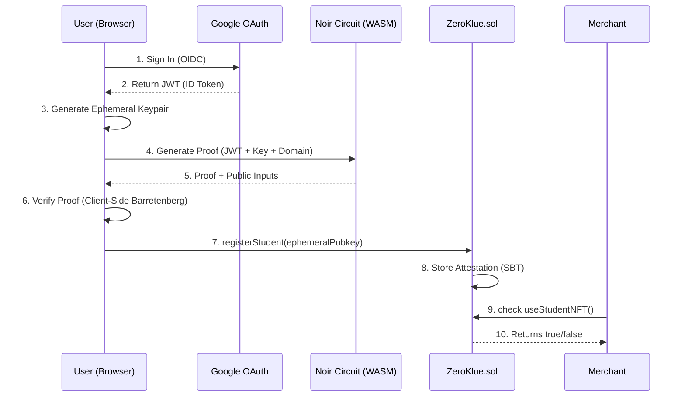

# Technical Deep Dive

## Architecture Overview

ZeroKlue uses a **Hybrid ZK Verification** model to balance privacy, security, and gas costs.

---

## 1. Zero-Knowledge Circuit (`main.nr`)
Our Noir circuit performs the following checks **privately**:
1.  **RSA Verification**: Verifies Google's signature on the JWT.
2.  **Domain Check**: Confirms the `hd` (Hosted Domain) claim in the JWT matches the public input.
3.  **Nonce Check**: Ensures `nonce` in JWT == `hash(ephemeralPubkey)`. This binds the off-chain auth to the on-chain session.

## 2. The Hybrid Model (The Pivot)
Initially, we planned for **Full On-Chain Verification**.
*   **Problem**: Verifying a Honk proof on-chain costs ~500k-1M gas. It limits scalability.
*   **Solution**: **Optimistic Client-Side Verification**.
    *   The frontend verifies the proof using the WASM verifier (`@aztec/bb.js`).
    *   If valid, it submits the `ephemeralPubkey` to the chain.
    *   *Trade-off*: We trust the frontend client code. For a hackathon/MVP, this is acceptable. For production, we would use an **App Chain** or **TEEs**.

## 3. Burner Wallets & Account Abstraction
- Uses `scaffold-eth` burner wallet.
- Key is stored in `localStorage`.
- **UX**: User never sees a seed phrase or Metamask popup. It feels like Web2.

## 4. Soulbound Token (SBT)
The `ZeroKlue.sol` contract implements a modified ERC-721 pattern.
- `transfer()` functions revert.
- Maps `address => VerificationData`.

## 5. Security Considerations
- **Replay Attacks**: Prevented by `nonce` check via Ephemeral Keys.
- **Identity Privacy**: circuit acts as a "Data Sanitizer".
- **Sybil Resistance**: Currently relies on Google Account limits (1 active session per account per browser).
